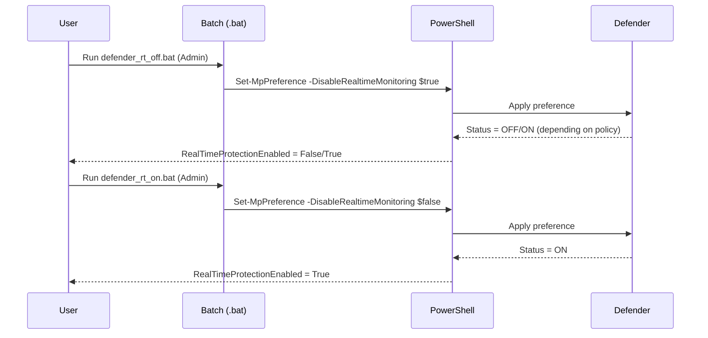
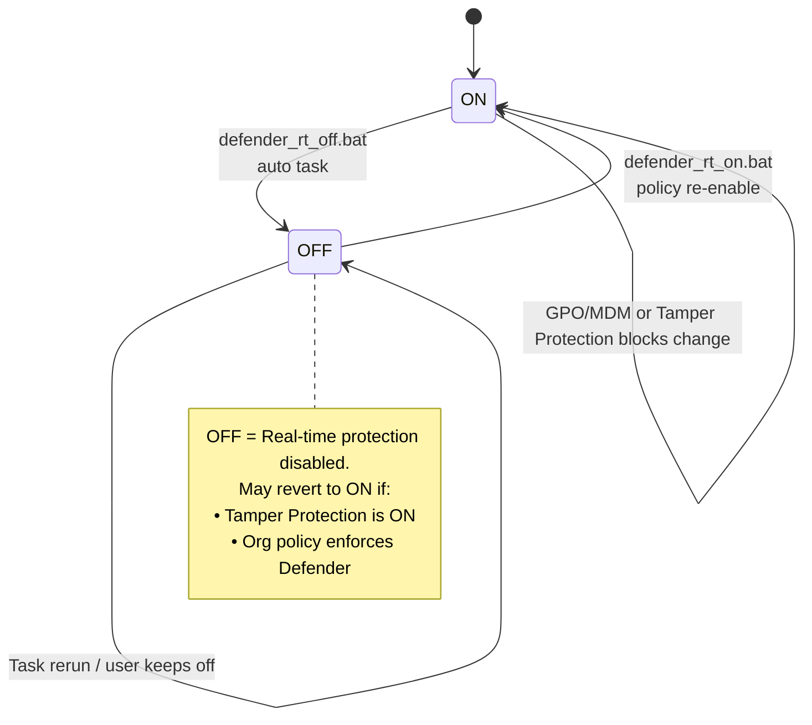

# Window-Defender-Real-Time-Switch

Tiny batch + PowerShell scripts to **toggle Microsoft Defender Real-time protection** and optionally **auto-disable it at startup**.

> ⚠️ **Use at your own risk.** Disabling real-time protection reduces security. On managed (work/school) PCs, policies may block these changes.

---

## Files

* `defender_rt_on.bat` – Enable Defender **Real-time protection**.
* `defender_rt_off.bat` – Disable Defender **Real-time protection**.
* `check_rt_status.bat` – Print current status (`True`/`False`).
* `install_wd_rt_auto_off.bat` – Install a **Scheduled Task** that turns RT **OFF** at **startup** (runs as `SYSTEM`).
* `remove_wd_rt_auto_off.bat` – Remove that Scheduled Task.

All scripts require **Administrator**.

---

## Requirements

1. **Run as Administrator** (right-click → *Run as administrator*).
2. **Tamper Protection** must be **OFF**
   Windows Security → *Virus & threat protection* → *Tamper Protection*.
   If it’s ON, Windows will block the change.
3. On work/school devices, **GPO/MDM** may override these settings.

---

## Quick Start

### Toggle manually

```bat
:: turn OFF real-time protection
defender_rt_off.bat

:: turn ON real-time protection
defender_rt_on.bat

:: check status (False = OFF, True = ON)
check_rt_status.bat
```

### Auto-disable on every reboot

Creates a startup task that runs as **SYSTEM** and flips RT off silently after boot.

```bat
install_wd_rt_auto_off.bat
```

Remove the task anytime:

```bat
remove_wd_rt_auto_off.bat
```

---

## How it works (Mermaid)

### 1) Auto-disable at startup (flow)

```mermaid
flowchart TD
    A[Windows boots] --> B[Task Scheduler triggers<br/>WD-RT-AutoOff@Startup (SYSTEM)]
    B --> C[PowerShell delay 15–30s<br/>(let Defender initialize)]
    C --> D[Set-MpPreference<br/>-DisableRealtimeMonitoring $true]
    D --> E{Success?}
    E -- Yes --> F[Write log to %ProgramData%\\wd-rt-toggle.log]
    E -- No --> G[Likely Tamper Protection or GPO/MDM]
    F --> H[RT = OFF]
    G --> H2[RT may remain ON]
```

### 2) Manual toggle (sequence)



### 3) Defender RT state (with policies)



---

## What the installer creates

* **Scheduled Task name:** `WD-RT-AutoOff@Startup`
  Trigger: **At startup** → runs as **SYSTEM**, **highest privileges**
* **Log file:** `%ProgramData%\wd-rt-toggle.log` (one line per run)

---

## Verify it works (optional)

If you added the provided verifier, run as **Administrator**:

```bat
verify_wd_rt_auto_off.bat
:: or wait longer before checking (in seconds)
verify_wd_rt_auto_off.bat 30
```

Expected output: `RealTimeProtectionEnabled = False`.

---

## Troubleshooting

* **“Access is denied” / “UnauthorizedAccess” / no effect**

  * Turn **Tamper Protection** OFF.
  * Ensure the `.bat` was run **as Administrator**.
  * Org policies (GPO/MDM) or 3rd-party AV may re-enable Defender.

* **Task exists but RT stays ON after boot**

  * Increase the delay inside the installer (e.g., 15s → 30s) and reinstall.
  * Some environments force Defender back ON shortly after startup.

* **Check current state quickly**

  ```bat
  check_rt_status.bat
  ```

  `False` means real-time protection is OFF.

---

## Security note

These scripts deliberately weaken protection. **Use only on trusted, isolated machines** (dev/lab). You are responsible for complying with your organization’s policies and local laws.

---

## License

MIT — see `LICENSE` for details.
Copyright (c) 2025 **Wei Jun**

---

## Credits

* Built-in PowerShell cmdlets: `Set-MpPreference`, `Get-MpComputerStatus`, `Start-Service`.
* Pure **Batch + PowerShell**. No external dependencies.
